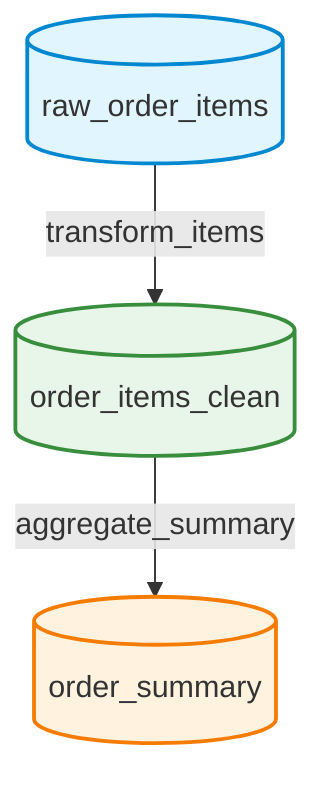

# Presentation Deck Materials

Here are the derived assets translated from your Python codebase into clean, presentation-ready formats. 

> **Pro-Tip for Maximum Impact:** 
> - For **Diagrams**, copy the Mermaid code below into [mermaid.live](https://mermaid.live/) or Notion to export a high-res PNG.
> - For **Terminal Logs**, copy the textual logs below into [carbon.now.sh](https://carbon.now.sh/) to create beautiful, syntax-highlighted screenshots of terminal outputs instead of raw text.

---

## 1. Medium Task DAG (Directed Acyclic Graph)



---

## 2. Action Space Table

| Action Name | Category | Real-World Application |
| :--- | :--- | :--- |
| **`read_data_sample`** | Diagnosis | Inspecting failing pipeline rows manually to find anomalous `NULL` values. |
| **`compare_schema`** | Diagnosis | Running diffs against upstream API contracts to catch silent changes. |
| **`patch_transformation`** | Remediation | Applying deduplication, parsing strings to currency, or stripping prefixes. |
| **`handle_drift`** | Remediation | Auto-resolving renamed columns or rotating API authentication tokens. |
| **`add_data_filter`** | Remediation | Dropping corrupted or `NULL` inbound vendor data dynamically. |
| **`run_pipeline`** | Validation | Triggering the DAG explicitly to test structural patches. |
| **`alert_upstream_team`** | Escalation | Pinging external teams when data is unfixable (e.g., API outages). |

---

## 3. Dynamic Drift Observation (Terminal Output)

*Copy the below text into Carbon.now.sh with the `Night Owl` or `Cobalt` theme:*

```text
[SYSTEM] Pipeline re-run: 5/8 assertions passing. +2 gained, -1 lost.
[WARNING] Dynamic schema drift observed during run window:
  --> 'raw_ads_insights.spend' renamed to 'total_spend'
  --> Auth format internally rotated to 'Bearer-v2'
  --> Upstream rate limit tightened to 1 calls/window

[USER] H1 (type_check) on clean_insights(spend): FAILED. Column empty.
```

---

## 4. Base Model Failure vs. GRPO Success (Medium Task)

*Mocking the side-by-side terminal evaluation. Great for a slide comparing RL impact.*

### BEFORE GRPO (Untrained Policy Fallback)
```text
[STEP 1] Action: patch_transformation({"column": "order_id", "patch_type": "null_fill"})
[PENALTY] -0.5: Patch applied without reading data first (Shooting Blind).
[STEP 2] Action: run_pipeline()
[RESULT] Pipeline re-run: 2/4 assertions passing. +0 gained. 
[STEP 3] Action: alert_owner({"team": "data_ops"})
[ERROR] Action invalid: 'alert_owner' is not a recognized primitive.
...
[TERMINATED] Max steps reached. Pipeline Failed.
```

### AFTER GRPO (Trained Policy)
```text
[STEP 1] Action: read_data_sample({"table": "raw_order_items"})
[RESULT] Diagnostics: Duplicate order_item_id discovered in payload.
[STEP 2] Action: patch_transformation({"step_id": "transform_items", "patch_type": "dedup", "column": "order_item_id"})
[RESULT] Patch 'dedup' on column 'order_item_id' applied successfully.
[STEP 3] Action: run_pipeline()
[RESULT] Pipeline re-run: 4/4 assertions passing. +2 gained, -0 lost.
[TERMINATED] ALL ASSERTIONS GREEN. Episode complete!
```
