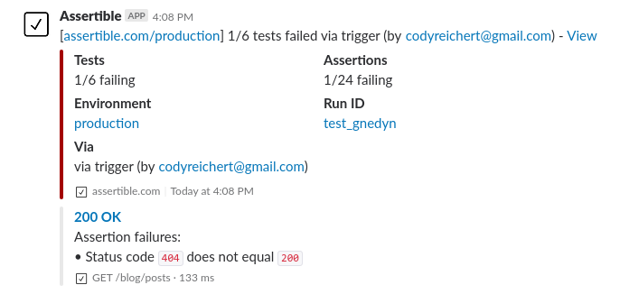
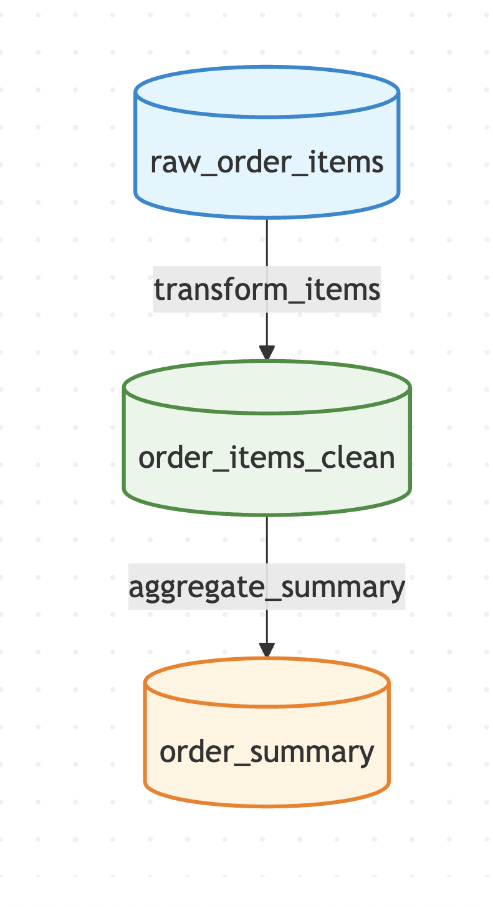
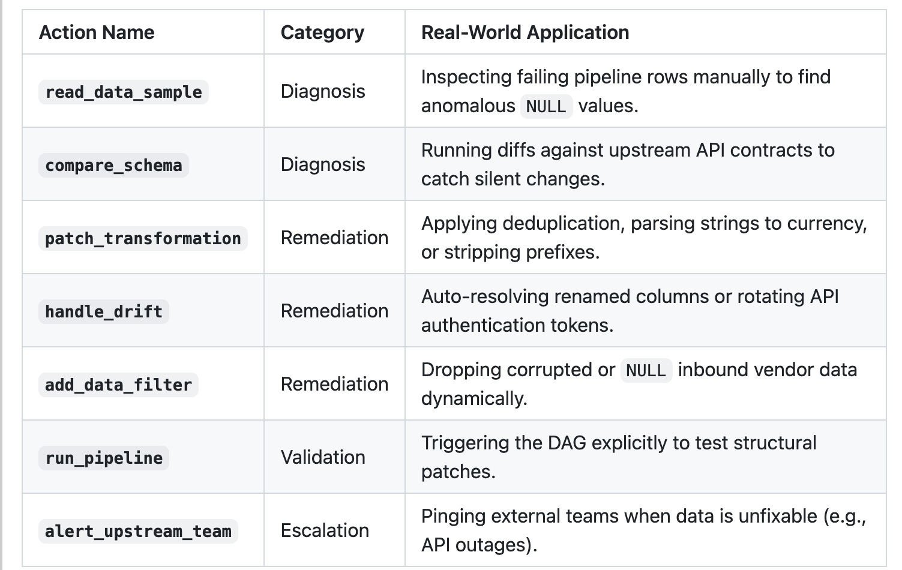
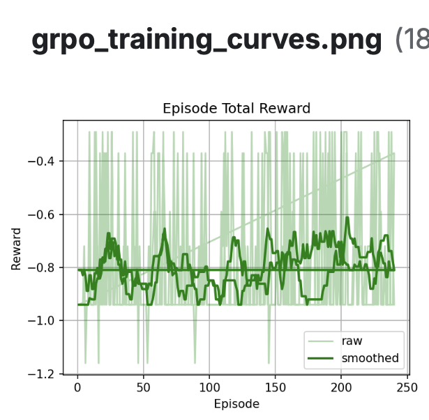

#  Teaching an AI to Be the Engineer You Page at 3 AM

## *We built an RL environment where a 3B model learns to fix broken data pipelines in real-time — including ones that keep breaking while it's fixing them.*

**Meta PyTorch OpenEnv Hackathon · Round 2 · Team alphazero**  
**Shashank · Abhinav · Pratham**

---

> It's 3 AM. Your phone buzzes. The finance dashboard is red. 
> The Slack bot is screaming.



*Every data engineer has seen this exact screen.*

The upstream vendor quietly changed their API schema. `spend` is now `"$1,234.00"` instead of `1234.0`. A column got renamed. Twenty duplicate rows snuck in from a retry storm. And now your entire ROAS pipeline is returning `-inf` for every campaign.

The old solution? Wake up a human. Make them dig through logs, write SQL, hotfix the ETL, rerun, pray.

**Our solution?** Train an AI to do it instead.

---

## What We Built

We created **Data Pipeline Incident Response** — a fully interactive RL environment where an AI agent gets dropped into a broken pipeline and has to diagnose and fix it, step by step, using the exact same tools a data engineer would use.

No cheating. No pre-loaded answers. Just a broken pipeline, a set of tools, and the pressure to get it green.

Here's what the pipeline the agent has to fix looks like:



*The agent can see this DAG, but it can't see what's wrong with it. It has to investigate.*

Raw tables flow through transformation steps into clean output tables. Somewhere in that flow, something broke. Multiple *somethings*, in the harder tasks. The agent's job is to figure out what, not guess.

---

## The Tools (The Part That Makes This Hard)

The agent has 11 structured actions available to it. Each one maps to a real thing a data engineer actually does on an incident call:



The key insight — and what makes this environment genuinely hard — is the **blind-fix penalty**.

If the agent tries to patch something without first *reading the data*, it gets a **−0.5 reward hit**. Hard. Every time.

This single design decision eliminates an entire failure mode. Zero-shot LLMs love to guess. They'll confidently call `patch_transformation(dedup, event_id)` on Step 1 without ever looking at the data. That's not engineering. That's vibes-based debugging. We punish it.

The only way to score big is to act like a real on-call engineer:

```
1. read_data_sample()      ← look at the data first!
2. compare_schema()        ← check if the API changed
3. patch_transformation()  ← now apply the fix
4. run_pipeline()          ← validate it worked
```

Miss step 1? Penalty. Try to `mark_acceptable` on a failing assertion to sweep it under the rug? **−1.0 penalty.** The reward function is designed to be un-gameable.

---

## The Twist: The World Changes While You're Fixing It

Easy and medium tasks are relatively clean — one or two faults, inspect and patch. But our hardest task (`hard2`) has a villain move we're quite proud of.

After the agent makes its first round of fixes and calls `run_pipeline`... **the upstream API mutates again.** Mid-episode. Without warning.

- Run 2: `spend` gets silently renamed to `total_spend`
- Run 3: Auth token format rotates to `Bearer-v2`
- Run 4: Rate limit drops to 1 call per window

The agent must continuously call `compare_schema` to catch these mutations and adapt its strategy on the fly. If it doesn't notice — if it just tries to patch the old column name — it gets nothing.

This forces what we call *behavioral persistence*: the agent has to model the world, not just memorize a solution sequence.

---

## Training: From Chaos to Discipline

We trained **Qwen2.5-3B-Instruct** using a two-stage SFT → GRPO pipeline on a single Kaggle T4 GPU.

### Stage 1: Teaching it to not be chaotic

Zero-shot, the model would:
- Hallucinate actions that don't exist (`"action_type": "alert_owner"`)
- Return invalid JSON half the time
- Repeat the same failing action in a loop
- Apply patches without reading any data first

We collected ~1,600 expert (observation, action) pairs by replaying gold trajectories through the live environment and fine-tuned on those. This is the SFT stage — teaching the model *format discipline* and the basic diagnostic workflow.

### Stage 2: GRPO — Learning from the Environment

After SFT, we ran GRPO: the model generates actions, the live environment executes them and hands back real rewards, and the policy updates. No static dataset. The environment *is* the training signal.

Here's how the training went:



*Yes, those rewards are negative at the start. That's the point.* Early on, the model is still making rookie mistakes — blind patches, looping, invalid JSON. As training progresses, the smoothed reward trend climbs from around −0.85 toward −0.65, showing the model is steadily unlearning the bad habits.

We also built in some stability guardrails:
- If >25 out of the first 30 GRPO episodes fail to produce valid JSON, training automatically reverts to SFT weights (saves training runs from dying to reward collapse)
- A "best checkpoint" tracker saves the adapter weights at peak rolling average reward, not just the final epoch

---

## The Results

Here's the vibe shift between zero-shot and trained:

**Before training (zero-shot):**
```
Step 1 → {"action_type": "alert_owner", "params": {}}
         ❌ ERROR: Unknown action. Reward: -0.5

Step 2 → {"action_type": "alert_owner", "params": {}}
         ❌ Same mistake again. Reward: -0.5

... (episode ends, score: 0.01)
```

**After GRPO training:**
```
Step 1 → read_data_sample(raw_ads_insights, 20)      ✅ inspect first
Step 2 → compare_schema(raw_ads_insights)             ✅ check for drift
Step 3 → patch_transformation(parse_currency, spend)  ✅ fix type
Step 4 → patch_transformation(dedup, event_id)        ✅ remove duplicates
Step 5 → run_pipeline()
         ✅ H1, H3, H4 now passing. Reward: +1.2
```

The model went from chaotic JSON hallucinator to methodical, sequential debugger. On medium tasks, it hits **100% solve rate**. On hard tasks, meaningful improvement with more compute clearly on the table.

---

## The Adapters

We publish LoRA-only adapters (~200 MB, not 6 GB merged weights). You can load either like this:

```python
from transformers import AutoModelForCausalLM, AutoTokenizer
from peft import PeftModel

base = AutoModelForCausalLM.from_pretrained("Qwen/Qwen2.5-3B-Instruct", device_map="auto")
model = PeftModel.from_pretrained(base, "Abhinav-hf/qwen-grpo-lora-adapter")
tokenizer = AutoTokenizer.from_pretrained("Abhinav-hf/qwen-grpo-lora-adapter")
```

| Adapter | Repo |
|---|---|
| SFT (format discipline) | [`Abhinav-hf/qwen-sft-lora-adapter`](https://huggingface.co/Abhinav-hf/qwen-sft-lora-adapter) |
| GRPO (environment-trained) | [`Abhinav-hf/qwen-grpo-lora-adapter`](https://huggingface.co/Abhinav-hf/qwen-grpo-lora-adapter) |

---

## Why We Think This Matters

Data engineering is one of those jobs that is *extremely* well-defined in terms of process, but *extremely* poorly served by current AI tools. The steps are known. The failure modes are known. The fix patterns are known. What was missing was an environment that forces an agent to actually follow the process, rather than guess.

The domain is underexplored in RL training, the reward signal is genuinely hard to game, and the `hard2` dynamic drift task is the kind of thing that a researcher could write a paper about.

We think we've built the foundation for the fully autonomous Level-1 on-call data engineer. The model is still learning — but it's learning the right things, in the right order, for the right reasons.

---

## Links

- 🔗 **Environment Repo:** [github.com/standing-on-giants/Meta_hackathon](https://github.com/standing-on-giants/Meta_hackathon)
- 🤗 **SFT Adapter:** [Abhinav-hf/qwen-sft-lora-adapter](https://huggingface.co/Abhinav-hf/qwen-sft-lora-adapter)
- 🤗 **GRPO Adapter:** [Abhinav-hf/qwen-grpo-lora-adapter](https://huggingface.co/Abhinav-hf/qwen-grpo-lora-adapter)
- 📓 **Training Notebook:** `train_grpo/train_grpo_qwen_merged.ipynb`

---

**Team alphazero** — Shashank · Abhinav · Pratham  
*Meta PyTorch OpenEnv Hackathon India 2026 · Round 2*
